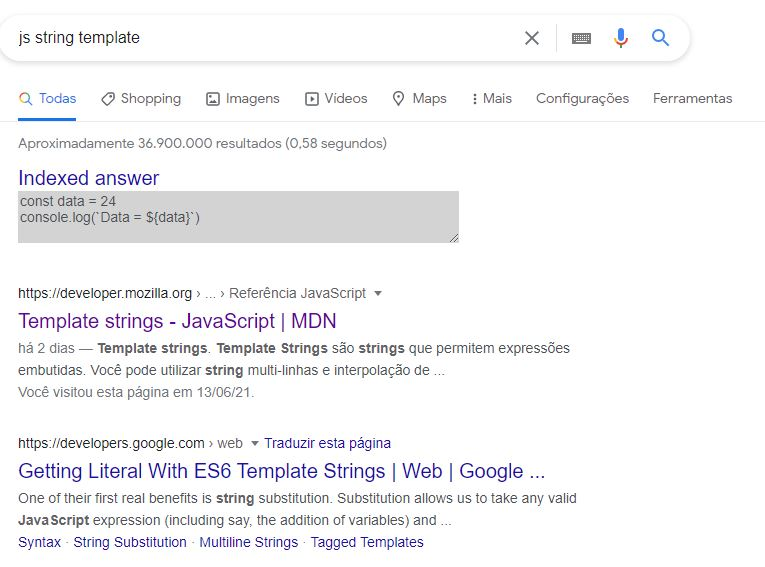

# Index query

Chrome plugin to attach an answer on top of google results for a specific queries.

If you tend to search google for some basic things such as some APIs calls or commands for CLIs, you can attach the answer in google reault page with this addon for chrome

# Using

- clone repo
- on chrome open chrome://extensions
- enable developer mode on top right
- click load unpacked
- select the folder of the cloned repo